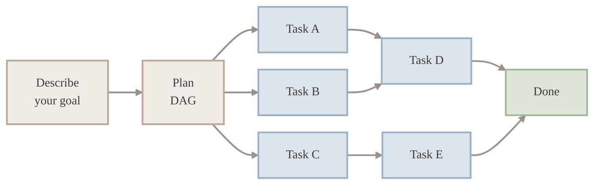
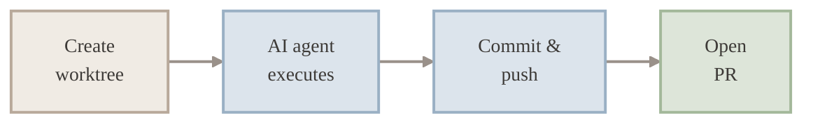
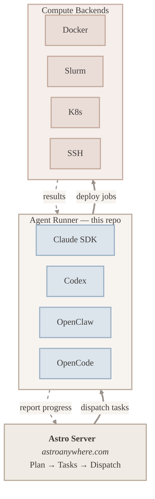

<h1 align="center">Astro Agent Runner</h1>
<p align="center">
  <strong>Connect your machines. Let AI do the work.</strong>
  <br />
  <br />
  <a href="https://www.npmjs.com/package/@astroanywhere/agent"></a>
  <a href="https://www.npmjs.com/package/@astroanywhere/agent"></a>
  <a href="https://nodejs.org"></a>
  <a href="./LICENSE"></a>
  <br />
  <br />
  <a href="https://astroanywhere.com/landing/">Website</a>
  &nbsp;&middot;&nbsp;
  <a href="https://astroanywhere.com">Dashboard</a>
  &nbsp;&middot;&nbsp;
  <a href="#install">Get Started</a>
  &nbsp;&middot;&nbsp;
  <a href="https://github.com/fuxialexander/astro">Astro Platform</a>
  <br />
  <br />
</p>

---

## Demo

<!-- TODO: Add video demo -->
<p align="center">
  <em>Video demo coming soon &mdash; watch a task dispatched from the browser, executed by the agent runner, and streamed back live.</em>
</p>

---

## What is Astro?

[**Astro**](https://astroanywhere.com/landing/) is an orchestrator for AI agents. It connects multiple jobs across different machines and compute backends &mdash; your laptop, GPU servers, HPC clusters, cloud VMs &mdash; so AI agents can work in parallel on the tasks that matter.

Mission control lives in the browser. Your machines do the work. The **Agent Runner** is the piece that runs on each machine &mdash; it receives tasks, executes AI agents on the available compute backends, and streams results back.

> **Self-hosting** is on the roadmap. Currently Astro runs as a hosted service at [astroanywhere.com](https://astroanywhere.com).

## Prerequisites

Create an account at [astroanywhere.com](https://astroanywhere.com) &mdash; you'll need it to authenticate your machines.

## Install

```bash
npx @astroanywhere/agent@latest launch
```

One command. It detects your AI providers, discovers your machine hardware, finds your SSH hosts, authenticates you, sets up everything, and starts listening for tasks.

No global install. `npx` fetches the latest version.

## What Happens

When you run `launch`, the agent runner detects your hardware, discovers installed AI providers, authenticates with Astro, and begins listening for tasks. Here's what you'll see:

```
$ npx @astroanywhere/agent@latest launch

  Astro Agent Runner v0.2.1

  +--------------------------------------------------------------+
  |  my-macbook (this device)                                    |
  |  Apple Silicon - darwin/arm64 - v0.2.1                       |
  |                                                              |
  |  Hardware                                                    |
  |    CPU   Apple M3 Max (16 cores)                             |
  |    RAM   128 GB (98 GB available)                            |
  |    GPU   Apple M3 Max (48 GB)                                |
  |                                                              |
  |  AI Agents                                                   |
  |    > claude-sdk v1.0.22 - model: sonnet-4                    |
  |    > codex v0.1.2                                            |
  |    > openclaw v0.3.1                                         |
  |    > opencode v0.2.0                                         |
  |                                                              |
  |  Runner: a1b2c3d4                                            |
  +--------------------------------------------------------------+

  Discovering SSH hosts... found 2: hpc-login, dev-vm

  To authenticate, open this URL in your browser:

    https://astroanywhere.com/device?code=ABCD-1234

  Waiting for approval...
  > Authenticated as you@example.com
  > Machine "my-macbook" registered

  Installing on remote hosts...

  +------------------------------------------------+
  |  [*] hpc-login (running)                       |
  |  user@hpc.university.edu                       |
  |  linux/x86_64 - 128 cores - 1024 GB RAM        |
  |    NVIDIA A100 (80 GB) x4                      |
  |                                                |
  |  AI Agents                                     |
  |    > claude-sdk v1.0.22                        |
  |    > openclaw v0.3.1                           |
  +------------------------------------------------+

  +------------------------------------------------+
  |  [*] dev-vm (running)                          |
  |  ubuntu@10.0.1.50                              |
  |  linux/x86_64 - 8 cores - 32 GB RAM            |
  |                                                |
  |  AI Agents                                     |
  |    > codex v0.1.2                              |
  |    > opencode v0.2.0                           |
  +------------------------------------------------+

  Remote agents: 2 running, 0 failed
  > Connected to relay

  Ready. Listening for tasks...
```

Your laptop and all remote hosts appear in Astro's **Environments** page. Dispatch tasks to any of them.

## Key Features

### 1. Planning &amp; Parallel Execution

Describe what you want to build. Astro decomposes your goal into a **dependency graph** (DAG) of tasks, then executes them in parallel across your machines &mdash; respecting the dependency order automatically.

A complex feature that would take hours of serial work gets broken into independent subtasks. Tasks without dependencies run simultaneously on separate git branches. Dependent tasks wait only for their upstream inputs, not for unrelated work to finish.



> Tasks A, B, C run in parallel. Task D waits for A + B. Task E waits for C. Total time = longest path, not sum of all tasks.

### 2. Multi-Agent Support

Astro works with the AI coding agents you already use. Install any of the supported agents &mdash; Astro detects them at startup and dispatches tasks automatically.

| Agent | Link | Steering |
|---|---|---|
| **Claude Code** | [anthropic.com/claude-code](https://docs.anthropic.com/en/docs/agents-and-tools/claude-code/overview) | Mid-execution + post-completion |
| **Codex** | [github.com/openai/codex](https://github.com/openai/codex) | Post-completion |
| **OpenClaw** | [github.com/openclaw-ai/openclaw](https://github.com/openclaw-ai/openclaw) | Post-completion |
| **OpenCode** | [github.com/opencode-ai/opencode](https://github.com/opencode-ai/opencode) | Post-completion |

All agents get full project context injection, real-time output streaming, and session preservation for multi-turn resume. Your API keys stay on your machine &mdash; Astro never sees them.

### 3. GitHub-Native Workflow

Every task runs on its own **git worktree** &mdash; a real, isolated branch with no conflicts. When the agent finishes, the runner commits the changes, pushes the branch, and opens a pull request automatically.



No merge conflicts between parallel tasks. Each branch is isolated. Review and merge at your own pace.

### 4. Mission Control

The [Astro Dashboard](https://astroanywhere.com) gives you full visibility across every project, task, and machine:

- **Monitor** &mdash; real-time streaming of agent output, tool calls, and file changes
- **Steer** &mdash; send guidance or redirect agents mid-execution
- **Decide** &mdash; approve, reject, or rerun from any device &mdash; no terminal needed
- **Scale** &mdash; multi-machine routing by load and capability

## Commands

```bash
# First time — set up everything and start
npx @astroanywhere/agent@latest launch

# Local only, skip SSH host discovery
npx @astroanywhere/agent@latest launch --no-ssh-config

# Start (already set up)
npx @astroanywhere/agent@latest start -f

# Stop
npx @astroanywhere/agent@latest stop

# Check what's running
npx @astroanywhere/agent@latest status

# Set up Claude authentication
npx @astroanywhere/agent@latest auth

# View or change settings
npx @astroanywhere/agent@latest config --show
npx @astroanywhere/agent@latest config --set maxTasks=8
```

## Remote Machines

`launch` reads your `~/.ssh/config`, discovers hosts, installs the agent runner over SSH, and starts them &mdash; all from your laptop.

Each remote host gets its own hardware detection and provider discovery. The agent runner reports back machine type (GPU Workstation, Apple Silicon, High-Memory Server, etc.), hardware specs (CPU, RAM, GPU), and available providers.

To set up a single remote machine manually, SSH in and run:

```bash
npx @astroanywhere/agent@latest launch --no-ssh-config
```

Astro picks the best available machine for each task based on load and capabilities.

## MCP Integration

Use the agent runner as an MCP server inside Claude Code:

```bash
npx @astroanywhere/agent@latest mcp
```

This gives Claude Code access to Astro tools &mdash; attach to tasks, send updates, check status.

## Configuration

Stored at `~/.config/astro-agent/config.json`. Most users never need to touch this.

| Setting | Default | Description |
|---|---|---|
| `maxTasks` | `4` | Max concurrent tasks |
| `logLevel` | `info` | Logging verbosity |
| `autoStart` | `false` | Start on login |

## Environment Variables

| Variable | Description |
|---|---|
| `ANTHROPIC_API_KEY` | Claude API key (alternative to OAuth) |
| `ASTRO_MACHINE_NAME` | Custom machine name |
| `ASTRO_LOG_LEVEL` | Override log level |

## Architecture



> **Astro Server** generates plans, breaks them into tasks, and dispatches to agent runners. Each **Agent Runner** (this repo) selects an AI agent, deploys jobs to compute backends, and streams progress back to the server.

## Related

- [Astro Platform](https://github.com/fuxialexander/astro) &mdash; the full planning + execution platform
- [Astro CLI](https://github.com/astro-anywhere/cli) &mdash; terminal UI for managing projects and tasks
- [Website](https://astroanywhere.com/landing/) &mdash; product overview
- [Dashboard](https://astroanywhere.com) &mdash; sign up and start planning

---

<p align="center">
  <a href="https://astroanywhere.com/landing/">astroanywhere.com</a>
</p>
