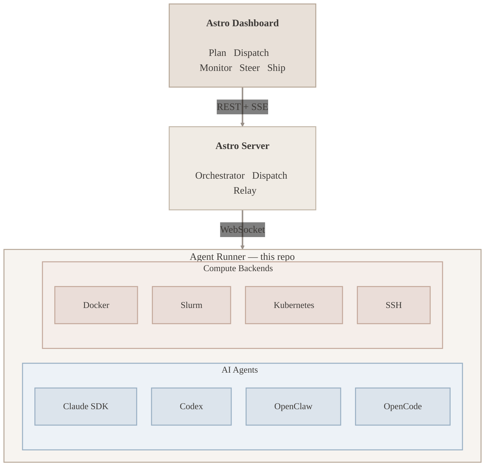

<h1 align="center">Astro Agent Runner</h1>
<p align="center">
  <strong>Connect your machines. Let AI do the work.</strong>
  <br />
  <br />
  <a href="https://www.npmjs.com/package/@astroanywhere/agent"></a>
  <a href="https://www.npmjs.com/package/@astroanywhere/agent"></a>
  <a href="https://nodejs.org"></a>
  <a href="./LICENSE"></a>
  <br />
  <br />
  <a href="https://astroanywhere.com/landing/">Website</a>
  &nbsp;&middot;&nbsp;
  <a href="https://astroanywhere.com">Dashboard</a>
  &nbsp;&middot;&nbsp;
  <a href="#install">Get Started</a>
  &nbsp;&middot;&nbsp;
  <a href="https://github.com/fuxialexander/astro">Astro Platform</a>
  <br />
  <br />
</p>

---

## Demo

<!-- TODO: Add video demo -->
<p align="center">
  <em>Video demo coming soon &mdash; watch a task dispatched from the browser, executed by the agent runner, and streamed back live.</em>
</p>

---

## What is Astro?

[**Astro**](https://astroanywhere.com/landing/) is an orchestrator for AI agents. It connects multiple jobs across different machines and compute backends &mdash; your laptop, GPU servers, HPC clusters, cloud VMs &mdash; so AI agents can work in parallel on the tasks that matter.

Mission control lives in the browser. Your machines do the work. The **Agent Runner** is the piece that runs on each machine &mdash; it receives tasks, executes AI agents on the available compute backends, and streams results back.

> **Self-hosting** is on the roadmap. Currently Astro runs as a hosted service at [astroanywhere.com](https://astroanywhere.com).

## Prerequisites

Create an account at [astroanywhere.com](https://astroanywhere.com) &mdash; you'll need it to authenticate your machines.

## Install

```bash
npx @astroanywhere/agent@latest launch
```

One command. It detects your AI providers, discovers your machine hardware, finds your SSH hosts, authenticates you, sets up everything, and starts listening for tasks.

No global install. `npx` fetches the latest version.

## What Happens

When you run `launch`, the agent runner detects your hardware, discovers installed AI providers, authenticates with Astro, and begins listening for tasks. Here's what you'll see:

```
$ npx @astroanywhere/agent@latest launch

  Astro Agent Runner v0.2.1

  +--------------------------------------------------------------+
  |  my-macbook (this device)                                    |
  |  Apple Silicon - darwin/arm64 - v0.2.1                       |
  |                                                              |
  |  Hardware                                                    |
  |    CPU   Apple M3 Max (16 cores)                             |
  |    RAM   128 GB (98 GB available)                            |
  |    GPU   Apple M3 Max (48 GB)                                |
  |                                                              |
  |  AI Agents                                                   |
  |    > claude-sdk v1.0.22 - model: sonnet-4                    |
  |    > codex v0.1.2                                            |
  |    > openclaw v0.3.1                                         |
  |    > opencode v0.2.0                                         |
  |                                                              |
  |  Runner: a1b2c3d4                                            |
  +--------------------------------------------------------------+

  Discovering SSH hosts... found 2: hpc-login, dev-vm

  To authenticate, open this URL in your browser:

    https://astroanywhere.com/device?code=ABCD-1234

  Waiting for approval...
  > Authenticated as you@example.com
  > Machine "my-macbook" registered

  Installing on remote hosts...

  +------------------------------------------------+
  |  [*] hpc-login (running)                       |
  |  user@hpc.university.edu                       |
  |  linux/x86_64 - 128 cores - 1024 GB RAM        |
  |    NVIDIA A100 (80 GB) x4                      |
  |                                                |
  |  AI Agents                                     |
  |    > claude-sdk v1.0.22                        |
  |    > openclaw v0.3.1                           |
  +------------------------------------------------+

  +------------------------------------------------+
  |  [*] dev-vm (running)                          |
  |  ubuntu@10.0.1.50                              |
  |  linux/x86_64 - 8 cores - 32 GB RAM            |
  |                                                |
  |  AI Agents                                     |
  |    > codex v0.1.2                              |
  |    > opencode v0.2.0                           |
  +------------------------------------------------+

  Remote agents: 2 running, 0 failed
  > Connected to relay

  Ready. Listening for tasks...
```

Your laptop and all remote hosts appear in Astro's **Environments** page. Dispatch tasks to any of them.

## What You Get with Astro Anywhere

| | Feature | |
|---|---|---|
| **Plan** | Describe a goal &rarr; Astro breaks it into a dependency graph | Graph, List, Timeline views |
| **Execute** | Dispatch to any machine &mdash; laptop, server, HPC | Parallel, isolated branches |
| **Monitor** | Real-time agent output, tool calls, file changes | Live streaming |
| **Steer** | Send guidance, redirect, or resume completed sessions | Multi-turn conversations |
| **Decide** | Approve, reject, or redirect from any device | No terminal needed |
| **Ship** | PRs created automatically per task | Branch-per-task isolation |
| **Scale** | Multi-machine routing by load & capability | SSH config auto-discovery |

## What the Agent Runner Does

When you execute a task in Astro, it lands on one of your machines. The agent runner:

- Creates an isolated git branch for the task
- Runs the selected AI agent with your project's full context
- Streams progress back to the Astro UI in real time
- Commits changes, pushes the branch, and opens a PR
- Supports mid-execution steering and post-completion session resume

Multiple tasks run in parallel &mdash; each on its own branch, no conflicts.

Your API keys stay on your machine. Astro never sees them.

## AI Providers

Auto-detected at startup. No configuration needed if any of these are installed:

| Provider | Type | How to Enable | Resume Support |
|---|---|---|---|
| **Claude SDK** | Anthropic Direct API | Run `astro-agent auth` or set `ANTHROPIC_API_KEY` | Mid-execution + post-completion |
| **Codex** | OpenAI CLI agent | Install [Codex CLI](https://github.com/openai/codex) (`npm i -g @openai/codex`) | Post-completion |
| **OpenClaw** | Gateway WebSocket | Install [OpenClaw](https://github.com/openclaw-ai/openclaw) (`npm i -g openclaw`) | Post-completion |
| **OpenCode** | CLI headless mode | Install [OpenCode](https://github.com/opencode-ai/opencode) (`bun i -g opencode`) | Post-completion |

All providers support:
- Task execution with full project context injection
- Real-time streaming of agent output, tool calls, and file changes
- Session preservation for multi-turn resume after completion
- Automatic execution summaries

**Claude SDK** additionally supports mid-execution steering &mdash; send guidance or redirect the agent while it's still running (via the Claude Agent SDK's `injectMessage`).

## Commands

```bash
# First time — set up everything and start
npx @astroanywhere/agent@latest launch

# Local only, skip SSH host discovery
npx @astroanywhere/agent@latest launch --no-ssh-config

# Start (already set up)
npx @astroanywhere/agent@latest start -f

# Stop
npx @astroanywhere/agent@latest stop

# Check what's running
npx @astroanywhere/agent@latest status

# Set up Claude authentication
npx @astroanywhere/agent@latest auth

# View or change settings
npx @astroanywhere/agent@latest config --show
npx @astroanywhere/agent@latest config --set maxTasks=8
```

## Remote Machines

`launch` reads your `~/.ssh/config`, discovers hosts, installs the agent runner over SSH, and starts them &mdash; all from your laptop.

Each remote host gets its own hardware detection and provider discovery. The agent runner reports back machine type (GPU Workstation, Apple Silicon, High-Memory Server, etc.), hardware specs (CPU, RAM, GPU), and available providers.

To set up a single remote machine manually, SSH in and run:

```bash
npx @astroanywhere/agent@latest launch --no-ssh-config
```

Astro picks the best available machine for each task based on load and capabilities.

## MCP Integration

Use the agent runner as an MCP server inside Claude Code:

```bash
npx @astroanywhere/agent@latest mcp
```

This gives Claude Code access to Astro tools &mdash; attach to tasks, send updates, check status.

## Configuration

Stored at `~/.config/astro-agent/config.json`. Most users never need to touch this.

| Setting | Default | Description |
|---|---|---|
| `maxTasks` | `4` | Max concurrent tasks |
| `logLevel` | `info` | Logging verbosity |
| `autoStart` | `false` | Start on login |

## Environment Variables

| Variable | Description |
|---|---|
| `ANTHROPIC_API_KEY` | Claude API key (alternative to OAuth) |
| `ASTRO_MACHINE_NAME` | Custom machine name |
| `ASTRO_LOG_LEVEL` | Override log level |

## Architecture



> **Agent Runner** (this repo) receives tasks, selects an AI agent, runs it on the appropriate compute backend, and streams results back.

## Related

- [Astro Platform](https://github.com/fuxialexander/astro) &mdash; the full planning + execution platform
- [Astro CLI](https://github.com/astro-anywhere/cli) &mdash; terminal UI for managing projects and tasks
- [Website](https://astroanywhere.com/landing/) &mdash; product overview
- [Dashboard](https://astroanywhere.com) &mdash; sign up and start planning

---

<p align="center">
  <a href="https://astroanywhere.com/landing/">astroanywhere.com</a>
</p>
