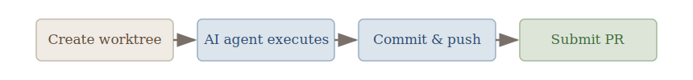
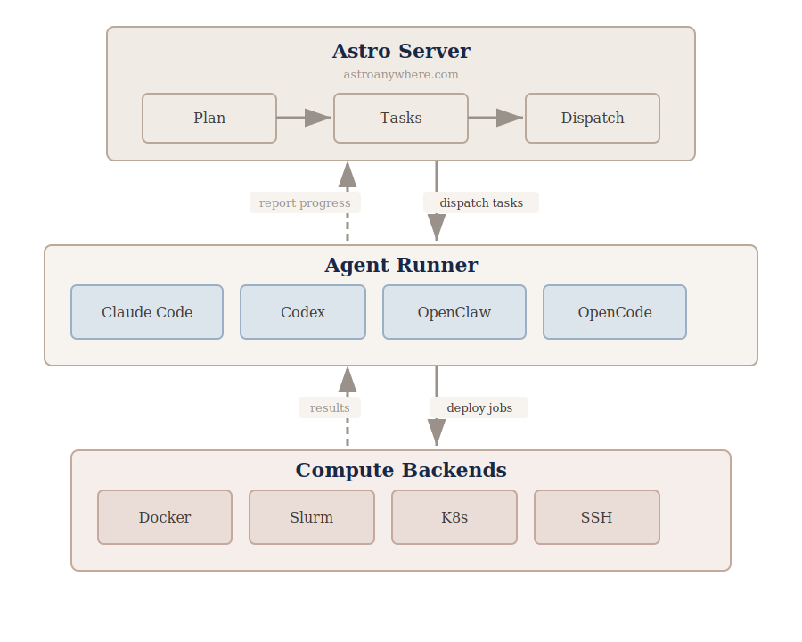

<h1 align="center">Astro Agent Runner</h1>
<p align="center">
  <strong>Connect your machines. Let AI do the work.</strong>
  <br />
  <br />
  <a href="https://www.npmjs.com/package/@astroanywhere/agent"></a>
  <a href="https://www.npmjs.com/package/@astroanywhere/agent"></a>
  <a href="https://nodejs.org"></a>
  <a href="./LICENSE"></a>
  <br />
  <br />
  <a href="https://astroanywhere.com/landing/">Website</a>
  &nbsp;&middot;&nbsp;
  <a href="#quick-start">Get Started</a>
  <br />
  <br />
</p>

---

## What is Astro?

[**Astro**](https://astroanywhere.com/landing/) is an orchestrator for AI coding agents. It takes a complex goal, decomposes it into a dependency graph of tasks, and executes them **in parallel** across your machines &mdash; your laptop, GPU servers, HPC clusters, cloud VMs.

Mission control lives in the browser. Your machines do the work. The **Agent Runner** is the piece that runs on each machine &mdash; it receives tasks, runs AI agents, and streams results back.

> **Self-hosting** is on the roadmap. Currently Astro runs as a hosted service at [astroanywhere.com](https://astroanywhere.com).

---

## Quick Start

### Step 1 &mdash; Register

Create an account at [astroanywhere.com](https://astroanywhere.com).

### Step 2 &mdash; Install

Install at least one AI coding agent:

```bash
npm i -g @anthropic-ai/claude-code   # Claude Code
npm i -g @openai/codex                # Codex
npm i -g openclaw                     # OpenClaw
bun i -g opencode                     # OpenCode
```

Optionally install [GitHub CLI](https://cli.github.com/) (`gh`) for automatic PR creation &mdash; recommended but not required.

Then launch the agent runner:

```bash
npx @astroanywhere/agent@latest launch
```

One command. It detects your AI agents, discovers your machine hardware, finds your SSH hosts, authenticates you, and starts listening for tasks. No global install &mdash; `npx` fetches the latest version.

### Step 3 &mdash; Start Building

Open the [Astro Dashboard](https://astroanywhere.com), create a project, and describe what you want to build. Try one of these to get started:

- **"Add dark mode support to my React app"** &mdash; a single focused task
- **"Build a REST API with auth, CRUD endpoints, and tests"** &mdash; Astro decomposes this into parallel tasks
- **"Refactor the data layer to use a repository pattern"** &mdash; multi-step refactoring across files

Or jump straight in and describe your own goal. Astro will generate a plan, show you the dependency graph, and execute across your machines.

### What You'll See

```
$ npx @astroanywhere/agent@latest launch

  Astro Agent Runner v0.2.1

  +--------------------------------------------------------------+
  |  my-macbook (this device)                                    |
  |  Apple Silicon - darwin/arm64 - v0.2.1                       |
  |                                                              |
  |  Hardware                                                    |
  |    CPU   Apple M3 Max (16 cores)                             |
  |    RAM   128 GB (98 GB available)                            |
  |    GPU   Apple M3 Max (48 GB)                                |
  |                                                              |
  |  AI Agents                                                   |
  |    > claude-code v1.0.22 - model: sonnet-4                   |
  |    > codex v0.1.2                                            |
  |    > openclaw v0.3.1                                         |
  |    > opencode v0.2.0                                         |
  |                                                              |
  |  Runner: a1b2c3d4                                            |
  +--------------------------------------------------------------+

  Discovering SSH hosts... found 2: hpc-login, dev-vm

  To authenticate, open this URL in your browser:

    https://astroanywhere.com/device?code=ABCD-1234

  Waiting for approval...
  > Authenticated as you@example.com
  > Machine "my-macbook" registered

  Installing on remote hosts...

  +------------------------------------------------+
  |  [*] hpc-login (running)                       |
  |  user@hpc.university.edu                       |
  |  linux/x86_64 - 128 cores - 1024 GB RAM        |
  |    NVIDIA A100 (80 GB) x4                      |
  |                                                |
  |  AI Agents                                     |
  |    > claude-code v1.0.22                       |
  |    > openclaw v0.3.1                           |
  +------------------------------------------------+

  +------------------------------------------------+
  |  [*] dev-vm (running)                          |
  |  ubuntu@10.0.1.50                              |
  |  linux/x86_64 - 8 cores - 32 GB RAM            |
  |                                                |
  |  AI Agents                                     |
  |    > codex v0.1.2                              |
  |    > opencode v0.2.0                           |
  +------------------------------------------------+

  Remote agents: 2 running, 0 failed
  > Connected to relay

  Ready. Listening for tasks...
```

Your laptop and all remote hosts appear in the [Astro Dashboard](https://astroanywhere.com). Dispatch tasks to any of them.

### Remote Machines via SSH

`launch` reads your `~/.ssh/config`, discovers reachable hosts, installs the agent runner over SSH, and starts them &mdash; all from your laptop. To set up a single remote machine manually:

```bash
ssh user@remote-host
npx @astroanywhere/agent@latest launch --no-ssh-config
```

Astro picks the best available machine for each task based on load and capabilities.

### Installing on Slurm (HPC Clusters)

On HPC clusters, login nodes enforce strict resource limits and kill long-running processes. You have two options for installing the agent runner:

#### Option A &mdash; From the login node (simplest)

SSH to the login node and run setup directly. The setup process is lightweight and completes in under a minute:

```bash
ssh user@hpc-login.university.edu
npx @astroanywhere/agent@latest launch --no-ssh-config
```

#### Option B &mdash; From a compute node (if the login node blocks it)

Request an interactive allocation first, then launch from the compute node:

```bash
ssh user@hpc-login.university.edu
srun --time=8:00:00 --mem=4G --pty bash
npx @astroanywhere/agent@latest launch --no-ssh-config
```

**Before running `launch`**, install at least one AI coding agent on the cluster:

```bash
npm i -g @anthropic-ai/claude-code   # Claude Code (recommended)
npm i -g @openai/codex                # or Codex
npm i -g openclaw                     # or OpenClaw
```

> **Note:** The agent runner uses Slurm to submit AI agent jobs to compute nodes automatically. Once installed, Astro dispatches tasks as Slurm jobs &mdash; you don't need to manage `sbatch` yourself.

### Re-setup &amp; Force Setup

When you reinstall the agent runner on a device that was previously configured, the existing configuration (SSH hosts, authentication tokens, relay settings) is reused from the first run. This means new SSH hosts won't be discovered and stale settings won't be refreshed.

To force a full re-setup:

```bash
npx @astroanywhere/agent@latest launch --force-setup
```

This re-runs the entire setup flow: re-detects AI agents, re-discovers SSH hosts, re-authenticates with the relay, and updates all stored configuration. Use this when:

- You've added new SSH hosts to `~/.ssh/config`
- Authentication tokens have expired or changed
- You've installed or removed AI agents
- The agent runner was updated to a new version with config changes
- Remote hosts were reconfigured or replaced

You can also run setup independently without starting the agent:

```bash
npx @astroanywhere/agent@latest setup --with-ssh-config
```

---

## Authentication

> **Key concept:** Astro does not access your API keys directly. The agent runner spawns AI agents (Claude Code, Codex, etc.) as subprocesses and passes your shell environment through. Each agent handles its own authentication using its own credentials. Your keys never leave your machine and Astro never sees them.

### Claude Code

Claude Code supports multiple authentication backends. Add the relevant environment variables to your shell profile (`~/.zshrc` on macOS, `~/.bashrc` on Linux).

**Anthropic cloud &mdash; OAuth token (recommended)**

```bash
claude setup-token
# Then add to your shell profile:
export CLAUDE_CODE_OAUTH_TOKEN=<paste-token-here>
```

**Anthropic cloud &mdash; API key**

```bash
export ANTHROPIC_API_KEY=sk-ant-...
```

**Amazon Bedrock**

```bash
export CLAUDE_CODE_USE_BEDROCK=1
export AWS_REGION=us-west-2

# Option 1: explicit keys
export AWS_ACCESS_KEY_ID=AKIA...
export AWS_SECRET_ACCESS_KEY=...

# Option 2: AWS profile (recommended)
export AWS_PROFILE=default
```

> Bedrock models use different model IDs (e.g., `anthropic.claude-sonnet-4-20250514`). The agent runner auto-detects Bedrock model formats and disables sandbox mode, which is not supported on Bedrock.

**Google Vertex AI**

```bash
export CLAUDE_CODE_USE_VERTEX=1
export CLOUD_ML_REGION=us-east5
export ANTHROPIC_VERTEX_PROJECT_ID=my-gcp-project
```

**Third-party models via Claude Code**

Claude Code can also be configured to use third-party model providers that expose an OpenAI-compatible API. This allows using models like MiniMax-M1, Kimi K2, GLM-5, or Doubao through Claude Code's interface. Set `ANTHROPIC_BASE_URL`, `ANTHROPIC_API_KEY`, and `ANTHROPIC_MODEL` to point at the provider:

```bash
# MiniMax
export ANTHROPIC_BASE_URL=https://api.minimax.chat/v1
export ANTHROPIC_API_KEY=<your-minimax-key>
export ANTHROPIC_MODEL=MiniMax-M1

# Kimi (Moonshot)
export ANTHROPIC_BASE_URL=https://api.moonshot.cn/v1
export ANTHROPIC_API_KEY=<your-moonshot-key>
export ANTHROPIC_MODEL=kimi-k2

# GLM (Zhipu AI)
export ANTHROPIC_BASE_URL=https://open.bigmodel.cn/api/paas/v4
export ANTHROPIC_API_KEY=<your-zhipu-key>
export ANTHROPIC_MODEL=glm-5

# Doubao (ByteDance / Volcengine ModelArk)
export ANTHROPIC_BASE_URL=https://ark.cn-beijing.volces.com/api/v3
export ANTHROPIC_API_KEY=<your-volcengine-key>
export ANTHROPIC_MODEL=<your-endpoint-id>
```

> **Experimental:** Third-party model support depends on Claude Code's compatibility layer. Some features (tool use, streaming, sandbox) may not work with all providers. This is not tested by the Astro team &mdash; refer to each provider's documentation for Claude Code integration details (e.g., [BytePlus ModelArk](https://docs.byteplus.com/en/docs/ModelArk/1928262), [Zhipu AI](https://docs.z.ai/devpack/tool/claude)).

**Troubleshooting:** On remote machines or HPC clusters, session-based login (`claude login`) may not work. Use one of the export methods above instead.

### Codex

Codex authenticates with an OpenAI API key. Add it to your shell profile:

```bash
export OPENAI_API_KEY=sk-...
```

Or configure it in `~/.codex/config.toml`:

```toml
model = "gpt-5.3-codex"
```

Available Codex models (run `codex -m <model_name>` to switch):

| Model | Description |
|---|---|
| `gpt-5.3-codex` | Latest frontier agentic coding model (default) |
| `gpt-5.4` | Latest frontier agentic coding model |
| `gpt-5.2-codex` | Frontier agentic coding model |
| `gpt-5.1-codex-max` | Codex-optimized flagship for deep and fast reasoning |
| `gpt-5.2` | Latest frontier model with improvements across knowledge, reasoning and coding |
| `gpt-5.1-codex-mini` | Optimized for codex &mdash; cheaper, faster, but less capable |

### OpenClaw &amp; OpenCode

These agents support multiple model providers (OpenAI, Anthropic, Google, etc.). Configure them through their own CLI or config files &mdash; refer to each agent's documentation for details.

---

## Commands

The agent runner provides several commands for managing your setup:

| Command | Description |
|---|---|
| `launch` | Setup (if needed) + start &mdash; the recommended one-command entry point |
| `start` | Start the agent runner (assumes setup is already complete) |
| `stop` | Stop the running agent process |
| `status` | Show current agent status, machine info, and connection state |
| `logs` | View agent runner logs (`-f` to follow, `-n` for line count, `--host` for remote) |
| `setup` | Run initial setup independently (detect agents, authenticate, configure relay) |
| `auth` | Set or clear Claude OAuth token for agent SDK authentication |
| `config` | Show, modify, reset, or import configuration |
| `providers` | List detected AI agent providers on this machine |
| `resources` | Show machine hardware (CPU, memory, GPU) |
| `hosts` | Discover remote hosts from SSH config |
| `connect` | Alias for `start --foreground` &mdash; run in the current terminal |
| `mcp` | Start MCP server for Claude Code integration (stdio mode) |

### Common Options

**`launch`** supports all setup and start options in one command:

```bash
# Force re-setup + start in foreground
npx @astroanywhere/agent@latest launch --force-setup -f

# Skip SSH discovery (local-only mode)
npx @astroanywhere/agent@latest launch --no-ssh-config

# Skip remote host launching (setup SSH but only run local)
npx @astroanywhere/agent@latest launch --no-launch-all

# Non-interactive mode (for scripts and batch jobs)
npx @astroanywhere/agent@latest launch --non-interactive --no-ssh-config
```

**`start`** controls the runtime behavior:

```bash
# Run in foreground with debug logging
npx @astroanywhere/agent@latest start -f --log-level debug

# Limit concurrent tasks
npx @astroanywhere/agent@latest start --max-tasks 2

# Keep worktrees after task completion (for debugging)
npx @astroanywhere/agent@latest start --preserve-worktrees
```

**`logs`** helps with troubleshooting:

```bash
# Follow logs in real time
npx @astroanywhere/agent@latest logs -f

# Filter logs for a specific task
npx @astroanywhere/agent@latest logs -f | grep "taskId"

# Show last 100 lines
npx @astroanywhere/agent@latest logs -n 100

# View logs from a remote host
npx @astroanywhere/agent@latest logs --host hpc-login
```

---

## Key Features

### 1. Planning &amp; Parallel Execution

Describe what you want to build. Astro decomposes your goal into a **dependency graph** (DAG) of tasks, then executes them in parallel across your machines &mdash; respecting the dependency order automatically.

A complex feature that would take hours of serial work gets broken into independent subtasks. Tasks without dependencies run simultaneously on separate git branches. Dependent tasks wait only for their upstream inputs, not for unrelated work to finish.

<p align="center">
  
</p>

> **Tasks A, B, C run in parallel.** Task D waits for A + B. Task E waits for C.
> Total time = **longest path**, not sum of all tasks.

### 2. Supporting Mainstream AI Agents

Astro works with the AI coding agents you already use. Install any supported agent &mdash; Astro detects it at startup and dispatches tasks automatically.

| Agent | Install | Website |
|---|---|---|
| **Claude Code** | `npm i -g @anthropic-ai/claude-code` | [anthropic.com/claude-code](https://docs.anthropic.com/en/docs/agents-and-tools/claude-code/overview) |
| **Codex** | `npm i -g @openai/codex` | [github.com/openai/codex](https://github.com/openai/codex) |
| **OpenClaw** | `npm i -g openclaw` | [github.com/openclaw-ai/openclaw](https://github.com/openclaw-ai/openclaw) |
| **OpenCode** | `bun i -g opencode` | [github.com/opencode-ai/opencode](https://github.com/opencode-ai/opencode) |

All agents get full project context injection, real-time output streaming, and session preservation for multi-turn resume. Your API keys stay on your machine &mdash; Astro never sees them.

### 3. GitHub-Native Workflow

Every task runs on its own **git worktree** &mdash; a real, isolated branch with no conflicts. When the agent finishes, the runner commits the changes, pushes the branch, and opens a pull request automatically.

<p align="center">
  
</p>

No merge conflicts between parallel tasks. Each branch is isolated. Review and merge at your own pace.

### 4. Mission Control &amp; Full Observability

The [Astro Dashboard](https://astroanywhere.com) gives you full visibility into every agent session, tool execution, and file change across all your projects and machines:

- **Observe** &mdash; see the full dialogue of AI agents, every tool call, every file diff, in real time
- **Steer** &mdash; send guidance or redirect agents mid-execution
- **Decide** &mdash; approve, reject, or rerun from any device &mdash; no terminal needed
- **Scale** &mdash; multi-machine routing by load and capability

---

## Architecture

<p align="center">
  
</p>

> **Astro Server** generates plans, breaks them into tasks, and dispatches to agent runners. Each **Agent Runner** (this repo) selects an AI agent, deploys jobs to compute backends, and streams progress back to the server.

---

## Integration in OpenClaw

<!-- Coming soon — waiting for Xi Fu to start -->

Monitor and control Astro directly inside [OpenClaw](https://github.com/openclaw-ai/openclaw). View project status, track running tasks, steer agents, and approve results &mdash; all from the OpenClaw interface.

> *This integration is under development. Details coming soon.*

---

<p align="center">
  <a href="https://astroanywhere.com/landing/">astroanywhere.com</a>
</p>
